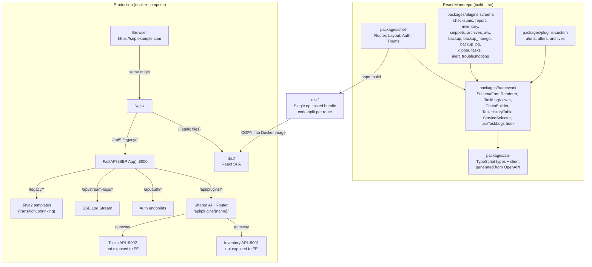
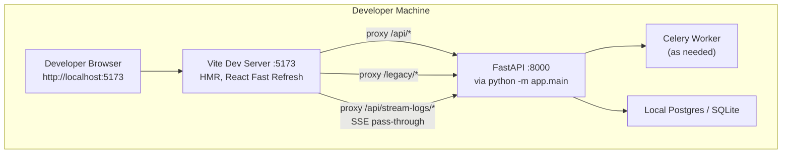

# 2. Target Architecture

## Production Architecture



**Key properties:**

- **Single deployment unit** — one docker-compose stack, one installer artifact, one deployable
- **Nginx serves static files** directly (no Python overhead for assets); only `/api/*` and `/legacy/*` go through FastAPI
- **Same origin** — no CORS, no cross-origin auth headaches
- **API Gateway** — Inventory and Tasks sub-apps are not reachable from the browser; SEP plugin routes proxy to them selectively
- **Strangler fig coexistence** — `/legacy/*` serves the remaining Jinja2 templates; shrinks as each plugin is migrated

## Development Architecture



**Key properties:**

- **No Nginx in dev** — Vite proxies everything
- **Vite HMR** on frontend changes (sub-second feedback)
- **FastAPI auto-reload** on backend changes (via `uvicorn --reload`)
- **SSE passes through Vite proxy cleanly** — no special configuration needed
- **Same cookie auth in dev** — developer logs in via Casdoor dev instance or mock user
- **Independent restart** — frontend and backend restart without affecting each other

### Vite configuration outline

```tsx
// frontend/packages/shell/vite.config.ts
export default defineConfig({
  server: {
    port: 5173,
    proxy: {
      '/api': { target: 'http://localhost:8000', changeOrigin: true },
      '/legacy': { target: 'http://localhost:8000', changeOrigin: true },
    },
  },
  build: {
    outDir: '../../dist',
    sourcemap: true,
  },
});
```

## Key Architectural Decisions

| Decision               | Choice                                 | Rationale                                                                      |
| ---------------------- | -------------------------------------- | ------------------------------------------------------------------------------ |
| Framework              | React 18 + TypeScript + MUI v7         | Prior work, Percona ecosystem alignment, `@percona/percona-ui`                 |
| Component library      | `@percona/percona-ui`                  | Active, MUI v7, SEP theme already being added by nachodd                       |
| Forms                  | react-hook-form                        | Shipped by percona-ui as a peer dep                                            |
| Server state           | React Query (TanStack Query)           | Standard for async data, works well with OpenAPI-generated clients             |
| Client state           | React Context for auth + theme         | Minimal; most state is server state or form state                              |
| Build tool             | Vite                                   | First-class MUI v7 and react-hook-form support, fast HMR                       |
| Package manager        | pnpm                                   | Matches percona-ui and Percona convention; strict isolation                    |
| Deployment             | Same-origin, single container stack    | No CORS, cookie auth unchanged, one installer                                  |
| Static file serving    | Nginx (prod), Vite (dev)               | Nginx is already the reverse proxy; Python should not serve static files       |
| API Gateway            | SEP proxies Inventory/Tasks sub-apps   | Controls exposed surface, enforces auth/validation                             |
| API routing            | `/api/plugins/{name}/` prefix          | Prevents collisions with core routes, enables plugin-level middleware          |
| API versioning         | None                                   | Internal product, one frontend client, no external API consumers yet           |
| Response format        | Bare Pydantic models                   | Consistent with existing Inventory/Tasks APIs, no wrapper ceremony             |
| Auth                   | Cookie + Bearer dual support           | Cookie for legacy Jinja2, Bearer for React, both via same `get_current_user()` |
| CSRF                   | Only for cookie-authenticated requests | Bearer-authenticated requests don't need CSRF protection                       |
| Plugin UI model        | Schema-driven + custom escape hatch    | Most plugins get auto-generated UIs; 3 complex plugins get custom React        |
| Frontend architecture  | Monorepo with package boundaries       | Clean boundaries without Module Federation runtime overhead                    |
| Micro-frontend runtime | No (monorepo only)                     | Team too small to justify; revisit if team grows or plugin ownership diverges  |
| Log streaming          | SSE (improve, don't replace)           | Already works, SEP-379 enhances it, core framework concern                     |
| Dev env                | Vite with `/api` and `/legacy` proxy   | HMR, no CORS, no Nginx in dev                                                  |

## Frontend Monorepo Structure

```
frontend/
├── packages/
│   ├── shell/                        # Layout, routing, theme, auth context
│   │   ├── src/
│   │   │   ├── App.tsx
│   │   │   ├── router.ts             # Discovers and registers plugin routes
│   │   │   ├── layouts/
│   │   │   │   ├── MainLayout.tsx    # Sidebar + header + content area
│   │   │   │   └── AuthLayout.tsx    # Login screen
│   │   │   ├── contexts/
│   │   │   │   ├── AuthContext.tsx
│   │   │   │   └── NotificationContext.tsx
│   │   │   └── pages/
│   │   │       ├── Home.tsx
│   │   │       └── Login.tsx
│   │   ├── vite.config.ts
│   │   └── package.json
│   │
│   ├── framework/                    # Shared cross-plugin components (built in Wave 0)
│   │   ├── src/
│   │   │   ├── components/
│   │   │   │   ├── SchemaFormRenderer/
│   │   │   │   ├── TaskLogViewer/
│   │   │   │   ├── TaskHistoryTable/
│   │   │   │   ├── ChainBuilder/
│   │   │   │   ├── ServiceSelector/
│   │   │   │   ├── SchemaSelector/
│   │   │   │   ├── TableSelector/
│   │   │   │   ├── AlertOnFailField/
│   │   │   │   └── ScheduledTasksPanel/
│   │   │   ├── hooks/
│   │   │   │   ├── useTaskLogs.ts    # SSE log stream hook
│   │   │   │   ├── useExecutionEvents.ts
│   │   │   │   ├── useTaskHistory.ts
│   │   │   │   └── useSchemaForm.ts
│   │   │   └── types/                # Hand-written framework types
│   │   └── package.json
│   │
│   ├── api/                          # API client (generated + manual)
│   │   ├── src/
│   │   │   ├── generated/            # openapi-typescript output
│   │   │   ├── client.ts             # Axios instance with auth + error handling
│   │   │   ├── hooks/                # React Query hooks per resource
│   │   │   └── types.ts              # Re-exports from generated
│   │   └── package.json
│   │
│   ├── plugins/
│   │   ├── checksums/                # Schema-driven — minimal code
│   │   │   ├── src/
│   │   │   │   ├── routes.ts         # Registers with shell router
│   │   │   │   └── index.ts
│   │   │   └── package.json
│   │   ├── backup/                   # Schema-driven with minor custom tweaks
│   │   ├── backup_mongo/
│   │   ├── backup_pg/
│   │   ├── alters/                   # CUSTOM — large form, multi-task creation
│   │   ├── archives/                 # CUSTOM — large form, YAML config
│   │   ├── alerts/                   # CUSTOM — PMM integration, backup/restore
│   │   └── ...
│   │
│   └── shared/                       # Tiny — things that don't fit framework/api
│       ├── src/
│       │   ├── constants.ts
│       │   └── utils.ts
│       └── package.json
│
├── package.json                      # Workspace root
├── pnpm-workspace.yaml
├── tsconfig.base.json
├── .eslintrc.json
└── .prettierrc.json
```

**Package boundary rules:**

- `shell` depends on `framework`, `api`, and directly imports plugin packages to register routes
- `framework` depends on `api` (for typed requests) and `@percona/percona-ui`
- `api` has no internal dependencies; only axios + react-query + generated types
- Plugin packages depend on `framework`, `api`, and `@percona/percona-ui`; plugins never depend on each other
- `shared` has no internal dependencies (lowest layer for constants/utils)

## Tech Stack Summary

### Core

- **React 18** with **TypeScript** (strict mode)
- **MUI v7** (Material UI) — via `@percona/percona-ui`
- **`@percona/percona-ui`** — Percona shared component library
- **react-hook-form** — form state and validation (peer dep of percona-ui)

### Build & Tooling

- **Vite** — dev server + production bundler
- **pnpm** — package manager with workspace support
- **Biome** or **ESLint + Prettier** — lint and format (match percona-ui's choice)
- **Vitest** — unit test runner
- **React Testing Library** — component testing
- **MSW (Mock Service Worker)** — API mocking for tests
- **Playwright** — end-to-end tests

### Server State & Networking

- **axios** — HTTP client (wrapped, with interceptors for auth + error handling)
- **TanStack Query (React Query)** — server state management, caching, background refetch
- **openapi-typescript** — generate TS types from the FastAPI OpenAPI schema
- **EventSource** (browser built-in) — SSE log streaming, wrapped in `useTaskLogs` hook

### Styling

- **Emotion** — CSS-in-JS (comes with MUI v7)
- **percona-ui theme tokens** — colors, typography, spacing all from the SEP theme in percona-ui
- **Fontsource** — `@fontsource/poppins`, `@fontsource/roboto` (already in percona-ui), plus Ardela Edge registered manually

## Deployment Model

### Production (docker-compose)

The existing docker-compose stack adds **one build step** and **one Nginx config block**. No new services.

**Dockerfile additions:**

```docker
# New stage: frontend build
FROM node:20-alpine AS frontend-builder
WORKDIR /app/frontend
COPY frontend/pnpm-lock.yaml frontend/package.json ./
COPY frontend/packages ./packages
RUN corepack enable && pnpm install --frozen-lockfile
RUN pnpm build

# Existing final stage — add COPY of dist/
FROM python:3.11-alpine
# ... existing Python setup ...
COPY --from=frontend-builder /app/frontend/dist /home/sep/app/frontend/dist
```

**Nginx config additions:**

```
# nginx.conf — new location blocks
server {
    # React SPA — served directly by Nginx
    location / {
        root /home/sep/app/frontend/dist;
        try_files $uri $uri/ /index.html;  # SPA fallback for client-side routing
    }

    # API, SSE, and legacy Jinja2 — proxied to FastAPI
    location /api/ {
        proxy_pass http://fastapi:8000;
        # SSE-friendly settings
        proxy_buffering off;
        proxy_read_timeout 24h;
    }
    location /legacy/ {
        proxy_pass http://fastapi:8000;
    }
}
```

**Installer impact**: Minimal. The frontend build is baked into the Docker image. Nginx config gets two new location blocks. No new services, no new ports, no new environment variables.

### Development

**No Nginx**. Two processes:

```bash
# Terminal 1: Backend
source venv/bin/activate
LOGGING=debug python3 -m app.main --start-celery

# Terminal 2: Frontend
cd frontend && pnpm --filter shell dev
```

The developer opens `http://localhost:5173` (Vite). API calls go through the Vite proxy to `http://localhost:8000` (FastAPI). Cookie auth works because Vite's proxy preserves cookies (same-origin from the browser's perspective).

### CI / CD

Add frontend steps to `.github/workflows/ci.yml`:

- **Frontend lint**: `pnpm lint`
- **Frontend typecheck**: `pnpm tsc --noEmit`
- **Frontend tests**: `pnpm test` (Vitest)
- **Frontend build**: `pnpm build` — fails CI if build breaks
- **E2E tests**: Playwright (added incrementally as pages are migrated)
- **Docker image build**: existing, updated to include frontend build stage

All of these run **in parallel** with the existing Python checks.

## What This Architecture Does NOT Include

- **No Module Federation** — monorepo build-time imports only. Any package can be ejected to a Module Federation remote later if a concrete need arises.
- **No separate frontend CDN or origin** — Nginx serves the React bundle from the same origin as the API.
- **No SSR/Nuxt/Next** — SPA is sufficient for this product.
- **No Webpack** — Vite handles both dev and production builds.
- **No Redux / MobX / Zustand for global state** — React Context + React Query cover all current needs. Reconsider if global client-side state grows.
- **No custom design system** — the design system IS `@percona/percona-ui` with the SEP theme.
