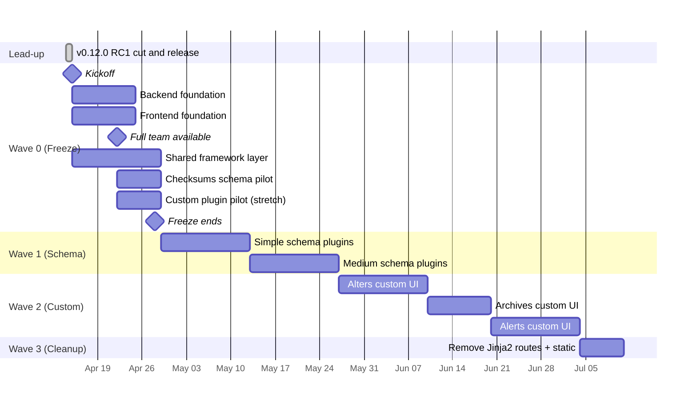

# 5. Migration Strategy & Waves

## The Strangler Fig Pattern

Both frontends coexist during the migration. The React app gradually replaces Jinja2 templates section by section. No big bang rewrite, no hard cutover date, no "everything breaks at once" risk.

```
Wave 0 (now):       Jinja2 serves everything. React foundation + shared framework built.
Wave 1 (schema):    React serves the schema-driven plugins (simple ones first).
Wave 2 (custom):    React serves the custom plugins (alerts, alters, archives).
Wave 3 (cleanup):   React serves everything. Jinja2 routes removed.
```

Each plugin migration is independently shippable. Rollback is a routing change — the Jinja2 route stays functional until explicitly removed in Wave 3.

## Transition Rules

These are the rules the team follows during the migration. They're explicit because the most expensive migration mistakes are ones where two people duplicated work or built the wrong thing because the rules weren't clear.

1. **New features in migrated sections** → React only. Don't duplicate in Jinja2.
2. **New features in not-yet-migrated sections** → Jinja2 is fine. Don't delay features for migration.
3. **Bug fixes** → whichever frontend is currently serving that page.
4. **API changes during transition** → consider both consumers (Jinja2 templates and React) until Jinja2 is fully removed.
5. **Never duplicate** — don't build the same feature in both frontends.
6. **Freeze window is sacred** — during Wave 0 (Apr 15 → Apr 28), other merges are paused. Exceptions require an explicit ask.

## The Freeze Window

<aside>
❄️

**Wave 0 runs during a one-sprint merge freeze** on non-migration work. This is the only freeze sprint available. Keeping it to one sprint is a hard constraint — the product has to keep moving.

</aside>

### Why we freeze

Any feature work merged during Wave 0 using the old Jinja2 pattern creates rework:

- A new plugin template written on Wave 0's day 3 has to be rewritten as a schema-driven plugin on day 10
- A new shared partial breaks assumptions the React framework layer is building against
- Bug fixes that touch `logs.js` or `chain-builder.js` create conflicts with the React replacements

Freezing prevents this waste.

### What's frozen

- New Jinja2 templates or routes
- New shared partials in `templates/`
- New JS in `static/js/`
- New plugin models following the old pattern

### What's NOT frozen

- Production hotfixes (obviously)
- Bug fixes that don't touch shared partials or legacy JS
- Backend work that's unrelated to plugins (database migrations, core improvements, etc.)
- Documentation
- CI / tooling improvements

The freeze is about **the frontend layer and plugin patterns**, not about all of SEP.

## Timeline

Dates are absolute (per the 2026-04-08 team meeting) and assume 2-week sprints starting Wednesday.



## Wave 0 — Foundation (2026-04-15 → 2026-04-28)

**Duration**: 2 weeks (one sprint)

**Team**: Reduced week 1 (1 BE + 1 FE + 1 Fullstack), full week 2 (+1 BE returning Apr 22)

**Scope**: Shared framework layer, first plugin end-to-end, CI, Docker

**Success criteria**: Two plugins (one schema-driven, one custom) working end-to-end in React, using the shared framework, deployed alongside the Jinja2 frontend

### Wave 0 work breakdown

#### Backend (primarily Yan, helped by Fullstack)

1. **Shared API router infrastructure** — `app/sep/api/router.py` with `/api/plugins/` prefix, auth dependency, per-plugin sub-router pattern. (2-3 days)
2. **Auth unification** — dual Bearer + cookie support in `get_current_user()`. Update CSRF middleware to skip Bearer-authenticated requests. (1-2 days)
3. **Plugin schema backend** — `app/sep/plugins/framework/schema.py` defining `PluginSchema`, `FormSection`, field classes. `schema_endpoint()` helper to register the schema route. (2-3 days)
4. **First plugin API — checksums** — implement `api_routes.py`, `schema.py`, response models. Replaces SEP-921 which becomes obsolete (or is folded into this). (2-3 days)
5. **Gateway audit** — find all frontend references to `/api/inventory/*` and `/api/tasks/*`, ensure plugin routes cover them. (1 day)
6. **OpenAPI spec tuning** — make sure FastAPI's OpenAPI output is rich enough for `openapi-typescript` to generate useful types. (0.5-1 day)
7. **CI** — run frontend build as part of Python CI pipeline. (0.5 day, fullstack can own)
8. **Docker** — add frontend build stage to Dockerfile. (0.5 day, fullstack can own)
9. **Nginx config** — add `location /` for React bundle, keep `/api/*` and `/legacy/*` proxied. (0.5 day)

**Total BE effort**: roughly 10-12 person-days. With 1.5-2 BE engineers and partial fullstack help over 2 weeks, achievable.

#### Frontend (primarily nachodd, helped by Fullstack)

1. **Monorepo setup** — pnpm workspace, shell/framework/api/plugins/shared packages, tsconfig, eslint, prettier, vite config. (1-2 days)
2. **`@percona/percona-ui` integration** — install, wire up `<ThemeContextProvider theme="sep">`, verify PR #9 (SEP theme) and #10 (react-hook-form fix) are merged upstream, Ardela Edge font registration. (1 day — already partially done in nachodd's local work)
3. **Shell** — MUI layout with sidebar, header, main content area, router, auth context, notification context. (2-3 days)
4. **API client package** — axios wrapper, auth interceptor, error handling, `openapi-typescript` codegen pipeline, React Query setup. (1-2 days)
5. **Framework components** (the big one):
   - `<SchemaFormRenderer>` and field mapping to percona-ui inputs (2-3 days)
   - `<TaskLogViewer>` and `useTaskLogs()` hook for SSE (2-3 days — log streaming is nontrivial)
   - `<TaskHistoryTable>` (1-2 days)
   - `<ChainBuilder>` (1-2 days)
   - `<ServiceSelector>`, `<SchemaSelector>`, `<TableSelector>` (1-2 days)
   - `<AlertOnFailField>` (0.5 day)
   - `<ScheduledTasksPanel>` (could slip to Wave 1 if time tight; 2 days)
6. **First schema-driven plugin (checksums)** end-to-end — validates the framework (1-2 days after checksums backend is ready)
7. **First custom plugin (backup or alters)** end-to-end — validates the escape hatch (3-5 days, stretch goal for Wave 0)

**Total FE effort**: roughly 17-22 person-days across 2 weeks with 1 FE + partial fullstack. Tight. The first custom plugin is a **stretch goal** — cut if time is tight.

#### Parallelization

Backend and frontend work is largely independent:

- BE can build the API router + auth + checksums API while FE builds the monorepo + framework components
- The FE can use mock data (MSW) for the checksums plugin UI until the real API is ready
- Once both sides have checksums working, they integrate and validate the end-to-end flow

**Dependency points**:

- OpenAPI schema needs to be stable before generated TS types are useful (mid-Wave 0)
- `<SchemaFormRenderer>` depends on the `PluginSchema` JSON format (both sides agree on shape early)
- `<TaskLogViewer>` depends on SSE endpoint behavior (re-verify existing endpoints work with `Authorization: Bearer` header)

### Wave 0 risks and mitigations

| Risk                                       | Mitigation                                                                                                                                                        |
| ------------------------------------------ | ----------------------------------------------------------------------------------------------------------------------------------------------------------------- |
| ~~AGPL license not approved in time~~      | **Resolved** — license reviewed and cleared for hard adoption as of 2026-04-10                                                                                    |
| nachodd's PRs #9/#10 don't merge in time   | Work from nachodd's branch directly during Wave 0; merge upstream later                                                                                           |
| Shared framework is harder than estimated  | Drop `<ScheduledTasksPanel>` to Wave 1. It's not needed for the first two plugin migrations                                                                       |
| SSE log streaming with Bearer token breaks | EventSource doesn't support custom headers — may need to pass Bearer via a short-lived single-use query param, or keep SSE cookie-authenticated during transition |
| One BE out until Apr 22                    | Week 1 BE work is scoped to what Yan can complete solo (API router + auth + first plugin API). Second BE picks up deeper work in week 2                           |
| "Perfect is the enemy of good"             | Ship functional components, not polished ones. Polish happens in Wave 1+ as plugins are migrated                                                                  |

### Scope reduction triggers

If Wave 0 is behind schedule, cut in this order:

1. **First** — `<ScheduledTasksPanel>` moves to Wave 1
2. **Second** — First custom plugin pilot (alters/backup) moves to start of Wave 2 (validate escape hatch then)
3. **Third** — OpenAPI-generated TS types become manual hand-written types (add codegen later)
4. **Fourth** — Extend freeze by 1 week (requires team approval and product signoff)
5. **Absolute floor** — Checksums schema-driven plugin end-to-end + core framework components + API router + dual auth. Without these, the freeze was wasted.

## Wave 1 — Schema-Driven Plugins (2026-04-29 → 2026-05-27)

**Duration**: ~4 weeks (2 sprints)

**Team**: Full team (4 people)

**Scope**: Migrate all schema-driven plugins

**Success criteria**: All 11 schema-driven plugins run on React. Jinja2 routes for these plugins marked deprecated but still functional.

### Plugins in order (rough priority)

Sprint 1 (Apr 29 → May 13):

- **inventory** (already has API, mostly CRUD) — validates the pattern for non-task-based plugins
- **snippets** (already a schema-driven prototype) — lowest risk, fastest win
- **report** (template-only today, minimal complexity)
- **atw** (single-route, mostly delegates to snippets infrastructure)
- **dipper** (service selection + script preview + history)

Sprint 2 (May 13 → May 27):

- **backup**, **backup_mongo**, **backup_pg** (YAML config, upload providers — may need schema field for YAML preview)
- **tasks** (generic task management — mostly shared components)
- **alert_troubleshooting** (snippet proxy, accordion UI — may stretch into Wave 2 if complex)

### Parallelization

Plugins are independent. Each sprint, assign plugins across the team (1-2 plugins per engineer depending on complexity). The schema-driven path means each plugin is "define schema + API routes + register with shell router" — 2-4 days per plugin.

**Fullstack engineer** can take plugins end-to-end; BE engineers focus on backend schema + API routes, FE engineer polishes form rendering edge cases.

## Wave 2 — Custom React Plugins (2026-05-27 → 2026-07-04)

**Duration**: ~5-6 weeks (3 sprints)

**Team**: Full team

**Scope**: Migrate the 3 custom React plugins

**Success criteria**: All 14 plugins run on React

Sprint 1 (May 27 → Jun 10): **alters**

Sprint 2 (Jun 10 → Jun 20): **archives** (shorter since alters pattern is established)

Sprint 3 (Jun 20 → Jul 04): **alerts**

Each custom plugin gets its own React package. They reuse the shared framework layer for chaining, logs, history, selectors — only the plugin-specific form/wizard is custom.

**Sequencing rationale**:

- alters and archives are structurally similar (massive forms, multi-task creation, YAML-ish configs). Do alters first, apply learnings to archives.
- alerts is very different (PMM API integration, not task-based). Doing it last means the team has maximum experience with the framework before tackling it.

## Wave 3 — Cleanup (2026-07-04 → 2026-07-11)

**Duration**: ~1 week

**Team**: Reduced (likely 1-2 people)

**Scope**: Remove legacy frontend

**Success criteria**: No Jinja2 templates, no jQuery, no vendor JS, CSRF middleware removed, cookie auth path in `get_current_user()` removed

### Tasks

1. Remove `templates/` directory (keep only emergency fallback if needed — e.g., login flow might need temporary Jinja2 support)
2. Remove `static/js/` legacy files (`logs.js`, `chain-builder.js`, `schema-selector.js`, `app.js`, etc.)
3. Remove CSRF middleware if cookie auth is fully retired
4. Remove the cookie-auth branch from `get_current_user()`
5. Remove `/legacy/*` Nginx location
6. Remove `sep_installer.sh` references to old static directories
7. Update [CLAUDE.md](http://CLAUDE.md) and developer docs

## Team Allocation

| Week                            | Yan (BE)                                            | 2nd BE                                  | nachodd (FE)                                         | Fullstack                       |
| ------------------------------- | --------------------------------------------------- | --------------------------------------- | ---------------------------------------------------- | ------------------------------- |
| Apr 15-21 (Wave 0 wk1)          | API router, auth unification, plugin schema backend | **OUT**                                 | Monorepo, shell, framework components start          | CI + Docker + Nginx, help FE    |
| Apr 22-28 (Wave 0 wk2)          | Checksums API, gateway audit                        | Alters OR backup custom pilot (stretch) | Framework components finish, checksums FE, Storybook | Help wherever needed            |
| Apr 29-May 13 (Wave 1 sprint 1) | 2 schema plugins BE                                 | 2 schema plugins BE                     | Polish framework, help with plugin FE                | 1 plugin end-to-end             |
| May 13-27 (Wave 1 sprint 2)     | 2-3 schema plugins BE                               | 2-3 schema plugins BE                   | Polish, backup YAML field, help custom plugin prep   | 1 plugin end-to-end             |
| May 27-Jun 10 (Wave 2 sprint 1) | alters BE                                           | alters BE (multi-task creation)         | alters FE custom UI                                  | Framework improvements, testing |
| Jun 10-20 (Wave 2 sprint 2)     | archives BE                                         | archives BE                             | archives FE custom UI                                | Support                         |
| Jun 20-Jul 04 (Wave 2 sprint 3) | alerts BE                                           | alerts BE (PMM integration)             | alerts FE custom UI                                  | Support                         |
| Jul 04-11 (Wave 3)              | Cleanup, remove legacy                              | Cleanup, remove legacy                  | Final polish, docs                                   | Cleanup                         |

**Caveats**:

- The table assumes the team stays at 4 and nobody is pulled off for urgent work. Realistic assumption? Unclear. Add buffer.
- Sprint ceremonies (standups, planning, retros, refinement) eat roughly 15-20% of capacity. Wave 0's aggressive scope assumes the team can mostly focus during the freeze — which is the whole point of the freeze.
- "Help wherever needed" means the team pair-programs, reviews PRs fast, and unblocks each other. Small tickets (per the team's explicit rule) support this.

## Rollback Strategy

During the transition, rolling back a migrated section is trivial:

1. **Change routing** so the section's URL goes back to the Jinja2 route (`/legacy/*`)
2. The Jinja2 templates remain functional — they were never removed
3. Fix the React version, redeploy, re-route

No data loss, no database rollback, no container rebuild for emergency rollback — just a config change.

**Rollback matrix** (what's affected by rolling back one plugin):

- Rolling back a schema-driven plugin: only the `/api/plugins/{name}/` routes stop being used by the frontend. The Jinja2 route serves that plugin. No other impact.
- Rolling back a custom plugin: same as above.
- Rolling back the shared framework layer: **not possible** after Wave 0. Every migrated plugin depends on it. The framework layer is tested end-to-end with two plugins during Wave 0 specifically to avoid this situation.

## Resolved Open Questions

These were marked as "open questions" in the earlier draft. All resolved now.

| Question                                                | Resolution                                                                                    | Rationale                                             |
| ------------------------------------------------------- | --------------------------------------------------------------------------------------------- | ----------------------------------------------------- |
| API versioning                                          | **No, skip it**                                                                               | No external consumers yet. Add when there are.        |
| Response format (bare vs wrapped)                       | **Bare Pydantic models**                                                                      | Consistent with existing APIs, no ceremony            |
| Token lifecycle                                         | **Access in memory, refresh in HttpOnly cookie, silent refresh** (recommendation for nachodd) | Security: avoid localStorage, minimize XSS surface    |
| SSE vs polling for real-time data                       | **Keep SSE** (improve per SEP-379)                                                            | Already works, core framework, SEP-379 enhances it    |
| Module Federation                                       | **No**, monorepo build-time only                                                              | Team too small, no independent deploy need            |
| State management                                        | **react-hook-form** (forms) + **React Query** (server state) + minimal Context (auth/theme)   | Shipped by percona-ui; standard React pattern         |
| Build tool                                              | **Vite**                                                                                      | MUI v7 support, react-hook-form support, fast HMR     |
| Linter/formatter                                        | Match percona-ui's choice                                                                     | Consistency with upstream library, less tooling noise |
| Test runner                                             | **Vitest** • **React Testing Library** • **MSW** for mocking                                  | Vite-native, Jest-compatible, fast                    |
| E2E tests                                               | **Playwright**                                                                                | Industry standard, good MUI support                   |
| Scheduled tasks panel                                   | **Wave 0 if possible, Wave 1 if tight**                                                       | Not blocking for first two plugin migrations          |
| Legacy `/api/inventory/*` and `/api/tasks/*` references | **Gateway audit in Wave 0** — find all references, replace with plugin routes                 | Part of the gateway pattern enforcement               |

## Risks & Mitigations

| Risk                                                                 | Severity | Likelihood | Mitigation                                                                                                                                               |
| -------------------------------------------------------------------- | -------- | ---------- | -------------------------------------------------------------------------------------------------------------------------------------------------------- |
| ~~AGPL license blocks percona-ui adoption~~                          | ~~HIGH~~ | —          | **Resolved** — license reviewed and cleared 2026-04-10                                                                                                   |
| Wave 0 runs out of time                                              | MEDIUM   | MEDIUM     | Scope reduction triggers documented above. First fallback: drop `<ScheduledTasksPanel>` and first custom pilot                                           |
| SSE + Bearer auth incompatibility                                    | MEDIUM   | MEDIUM     | EventSource can't send custom headers. Workaround: keep log-streaming endpoints cookie-authenticated during transition (SEP-662 already makes that safe) |
| Other BE out until Apr 22 reduces week 1 capacity                    | MEDIUM   | CERTAIN    | Wave 0 week 1 is scoped to solo-capable tasks                                                                                                            |
| Team pulled off for unplanned work                                   | MEDIUM   | MEDIUM     | Freeze window is explicit. Product/PM commitment required before Apr 15                                                                                  |
| Complex plugin (alters/archives/alerts) harder than estimated        | MEDIUM   | MEDIUM     | Validated in Wave 0's stretch goal (first custom pilot). If Wave 0 pilot slips, the risk carries into Wave 2                                             |
| Shared Jinja2 partials create cross-plugin coupling during migration | LOW      | MEDIUM     | Audit shared partials in Wave 0. Migrate shared partials as framework components first                                                                   |
| Bus factor on percona-ui (3 maintainers)                             | LOW      | LOW        | Push for nachodd / Yan to get review/commit rights on percona-ui if SEP depends on it heavily                                                            |
| nachodd's PRs don't merge before Wave 0 starts                       | LOW      | MEDIUM     | Can work from his branch during Wave 0, merge upstream in parallel                                                                                       |
| OpenAPI-generated types are low quality                              | LOW      | MEDIUM     | Fallback to hand-written types for critical paths; regenerate later                                                                                      |
| MUI v7 has breaking changes from v5 examples we find online          | LOW      | HIGH       | Use percona-ui's components (they're v7-native). Look at Everest UI code only for patterns, not copy-paste                                               |
| Rebrand timeline forces early theme changes                          | LOW      | UNKNOWN    | nachodd's SEP theme in percona-ui is already aligned with the rebrand. Coordinate with design/marketing for the cutover                                  |
| Casdoor replacement announced mid-migration                          | LOW      | LOW        | Auth abstractions are clean — `get_current_user()` is the only touch point. Replacing Casdoor shouldn't touch plugin code                                |

## Success Metrics

**Wave 0** is successful if:

- Two plugins run end-to-end on React (one schema-driven, one custom — stretch)
- All Wave 0 framework components have Storybook stories
- CI builds frontend + backend together
- Docker image includes the frontend bundle
- No regressions in the existing Jinja2 frontend
- Nginx serves the React bundle correctly in the dev deployment

**Wave 1** is successful if:

- All schema-driven plugins (11 total) run on React
- Feature parity verified per plugin
- No duplication between Jinja2 and React for migrated plugins
- Wave 1 ships roughly on schedule (±1 week)

**Wave 2** is successful if:

- All 14 plugins run on React
- Custom plugins reuse the shared framework layer (no reimplementation of chaining/logs/history)
- QA signs off on feature parity

**Wave 3** is successful if:

- Jinja2 templates are deleted
- Legacy JS (`logs.js`, `chain-builder.js`, etc.) is deleted
- CSRF middleware is either deleted or scoped only to unauth endpoints
- Total backend LOC drops significantly (template removal alone)
- No `/legacy/*` routes remain

## What "Mostly Done This Quarter" Means

The team goal is "mostly done this quarter" (Q2 2026). With the schedule above:

- **Wave 0 complete by Apr 28** — foundation ready
- **Wave 1 complete by May 27** — all schema-driven plugins migrated
- **Wave 2 complete by Jul 04** — custom plugins migrated
- **Wave 3 complete by Jul 11** — legacy removed

Q2 ends June 30. With the schedule above, **schema-driven plugins and two of three custom plugins are complete by end of Q2**. Alerts and cleanup slip into the first weeks of Q3.

If the team wants Q2 full completion, Wave 2 needs to compress by ~2 weeks — either by parallelizing alters/archives/alerts across multiple engineers more aggressively, or by descoping alerts. Flag for team decision.
