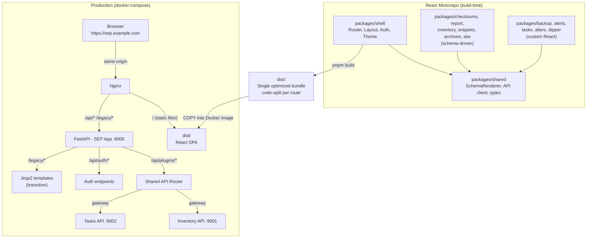

# API-First Migration & React Frontend

## 1. Vision & Goals

SEP is migrating from server-rendered Jinja2 templates to an **API-first architecture** with a **React frontend**. The guiding principle: **everything works from the API**. Every feature, every plugin interaction, every data flow is driven by well-defined JSON endpoints. The React frontend is one consumer of those endpoints — external scripts, dashboards, and CLI tools could be others.

### Goals

- **API-first**: Every plugin exposes JSON API endpoints. The API is the product; the UI is a client.
- **React frontend**: Using Percona's shared packages (`@percona/ui-lib`, `@percona/design`) and MUI, aligned with Percona's broader frontend ecosystem.
- **Simplified plugin development**: Schema-driven plugins get their UI auto-generated. Complex plugins get full React components. Both paths are documented and supported.
- **Same-origin deployment**: One Docker container, one installer artifact. No CORS, no separate frontend server.
- **Incremental migration**: Strangler fig pattern. Both frontends coexist. Sections migrate one at a time. Rollback is always possible.

### Non-Goals

- Separate frontend/backend deployables
- API versioning (no `/api/v1/` — may revisit when external consumers exist)
- Response envelope wrapper (`{ data, meta }`) — use bare Pydantic models
- Bearer token implementation (auth supports it structurally; token lifecycle deferred to implementation)
- Server-side rendering (SSR/Nuxt/Next) — SPA is sufficient for this product

---

## 2. Current State & Prior Work

### Architecture Today

SEP is a FastAPI application with three mounted sub-applications:

```
app/main.py (main FastAPI app)
├── /api/inventory → Inventory API (standalone, full REST)
├── /api/tasks     → Tasks API (standalone, full CRUD + execution)
└── /              → SEP app (Jinja2 UI, 13 plugins, auth, CSRF)
```

- **13 plugins** in `app/sep/plugins/`, all returning HTML via `TemplateResponse`
- **80+ Jinja2 templates** (`.html.j2`) with jQuery 3.7.1, simple-datatables, select2, vanilla JS
- **Cookie-based auth** via Casdoor OAuth → JWT in signed `authToken` cookie
- **CSRF**: OWASP Signed Double-Submit Cookie pattern (already SPA-compatible per SEP-662)
- **No frontend build infrastructure**: no `package.json`, no bundler, no TypeScript

### Prior Decisions & Work

| Ticket  | Status    | What                                                                             |
| ------- | --------- | -------------------------------------------------------------------------------- |
| SEP-235 | Done      | React Review Planning — team decided on React with Percona packages              |
| SEP-464 | Done      | Micro Frontend POC — Webpack Module Federation, React remotes, `@percona/ui-lib` |
| SEP-365 | Done      | Inventory table rebuilt in React via CDN (no SPA)                                |
| SEP-636 | Done      | Backend changes for SPA enablement                                               |
| SEP-662 | Done      | CSRF token persistence for SPA compatibility                                     |
| SEP-610 | In Review | Running Tasks — first full React plugin using MUI                                |
| SEP-921 | Ready     | JSON API endpoints for checksums plugin (API-first pattern)                      |

### Existing Epics

| Epic    | Status         | Scope                        |
| ------- | -------------- | ---------------------------- |
| SEP-188 | Ready for Work | Convert SEP into an API      |
| SEP-475 | Ready for Work | FE — Inventory React version |

### A Note on Framework Choice

<aside>
💡

The Frontend Migration doc includes a thorough Vue vs React analysis. Vue has genuine technical strengths — template affinity with Jinja2, fine-grained reactivity, smaller bundle baseline, and cohesive official ecosystem. For a greenfield project with a small team, Vue would be a strong choice.

</aside>

However, the organizational context points to React:

- **Prior investment**: Four tickets of shipped React work, including a validated Module Federation POC
- **Percona ecosystem**: Seven shared React packages (`@percona/ui-lib`, `@percona/design`, etc.) used by other Percona products. No Vue equivalents exist.
- **Future alignment**: Potential merge into a React-based product (Everest). Using React eliminates the need for cross-framework micro-frontend bridging.
- **Hiring & staffing**: Percona's frontend pipeline is React-oriented. Using Vue creates a staffing risk.

The Vue analysis remains a valuable reference for understanding framework trade-offs. The architecture decisions in this document (API design, migration strategy, plugin model) are largely framework-agnostic — the core ideas from the Frontend Migration doc apply regardless of framework.

---

## 3. Target Architecture



### Key Architectural Decisions

| Decision                  | Choice                                 | Rationale                                                                    |
| ------------------------- | -------------------------------------- | ---------------------------------------------------------------------------- |
| **Deployment**            | Same-origin, single container          | No CORS, cookie auth works, one installer artifact                           |
| **API Gateway**           | SEP proxies to sub-apps                | Controls exposed surface, adds auth/validation layer                         |
| **API routing**           | `/api/plugins/{name}/` prefix          | Prevents collision with core routes, enables plugin-level middleware         |
| **Auth**                  | Cookie + Bearer (dual support)         | Cookie for legacy Jinja2, Bearer for React. Drop cookies when Jinja2 removed |
| **CSRF**                  | Only for cookie-authenticated requests | Bearer-authenticated requests don't need CSRF                                |
| **Plugin UI**             | Schema-driven + custom escape hatch    | Simple plugins get auto-generated UI; complex ones get full React            |
| **Frontend architecture** | Monorepo with package boundaries       | Start simple, graduate to Module Federation when needed                      |
| **Framework**             | React + MUI + Percona packages         | Ecosystem alignment, prior work, team decision                               |

---

## 4. Migration Strategy

### The Strangler Fig Pattern

Both frontends coexist. The React app gradually replaces Jinja2 templates section by section. No big bang rewrite.

```
Phase 1 (now):   Jinja2 serves everything. React foundation being built.
Phase 2 (hybrid): React serves migrated sections. Jinja2 serves the rest.
Phase 3 (done):  React serves everything. Jinja2 routes removed.
```

### Transition Rules

1. **New features** in migrated sections → React only
2. **New features** in not-yet-migrated sections → Jinja2 (don't delay features for migration)
3. **Bug fixes** → whichever frontend is currently serving that page
4. **API changes** → consider both consumers until Jinja2 is fully removed
5. **Never duplicate** — don't build the same feature in both frontends

### Migration Waves

<aside>
0️⃣

**Wave 0 — Foundation** (prerequisite for everything else)

- Shared API router infrastructure
- React monorepo scaffold (shell, shared, first plugin package)
- Auth unification (Bearer + cookie in `get_current_user()`)
- OpenAPI → TypeScript type generation pipeline
- Schema renderer component (for schema-driven plugins)
- CI/CD: frontend build step, linting, testing
- Docker: add frontend build to container image
</aside>

<aside>
1️⃣

**Wave 1 — Schema-driven plugins** (fastest wins)

checksums, report, inventory, snippets, archives, atw

For each: define schema + add API routes → auto-generated UI

</aside>

<aside>
2️⃣

**Wave 2 — Custom plugins (moderate complexity)**

dipper, tasks (SSE streaming → decide polling vs WebSocket)

Full React components needed

</aside>

<aside>
3️⃣

**Wave 3 — Custom plugins (high complexity)**

backup, backup_mongo, backup_pg (multi-step restore wizards, multiple payload types)

alerts + alert_troubleshooting (interactive troubleshooting, real-time data)

alters (chain builder)

</aside>

<aside>
4️⃣

**Wave 4 — Cleanup**

Remove Jinja2 templates and template routes

Remove jQuery, vendor JS, template CSS

Remove CSRF middleware (if cookies fully removed)

Remove cookie auth path from `get_current_user()`

</aside>

### Rollback

During transition, rolling back a migrated section is trivial: change the route to serve the Jinja2 template instead of the React app. The Jinja2 routes remain functional until explicitly removed in Wave 4.

---

## 5. Risks & Open Questions

### Risks

| Risk                                                  | Mitigation                                                                                                             |
| ----------------------------------------------------- | ---------------------------------------------------------------------------------------------------------------------- |
| **Schema renderer takes too long to build**           | Start with 1-2 schema plugins manually to validate the pattern before building the renderer                            |
| **Complex plugin JS is harder to port than expected** | Audit each complex plugin's JS before estimating. Chain builder (alters) and troubleshooting (alerts) are highest-risk |
| **Sub-app API changes break the gateway**             | Plugin API routes use typed response models. Integration tests catch contract drift                                    |
| **Team pulled into sprint work**                      | Scope reduction triggers: if behind by >2 weeks, cut Wave 3 to next quarter                                            |
| **Jinja2 templates with shared partials**             | Audit cross-plugin template dependencies before starting. Migrating one plugin may force migrating shared partials     |

### Open Questions

| Question                              | When to Decide                                                              |
| ------------------------------------- | --------------------------------------------------------------------------- |
| **API versioning**                    | When external API consumers exist (not now)                                 |
| **Response format standardization**   | During Wave 0 — define and document the convention                          |
| **Token lifecycle**                   | During Wave 0 — how does Casdoor's OAuth flow work in a SPA?                |
| **SSE vs polling for real-time data** | Before Wave 2 — SEP-610 chose polling; is that the pattern for all plugins? |
| **Module Federation graduation**      | When a concrete need for independent deployment arises                      |

---

## 6. API Design

### Hybrid Router Pattern

A shared API router provides consistent middleware (auth, error handling). Each plugin registers its own sub-router.

```python
# app/sep/api/router.py — Shared API router
api_router = APIRouter(prefix="/api")

# Core routes
api_router.include_router(auth_router, prefix="/auth", tags=["auth"])

# Plugin routes — each under /api/plugins/{name}/
plugins_router = APIRouter(prefix="/plugins")
plugins_router.include_router(checksums_api, prefix="/checksums", tags=["checksums"])
plugins_router.include_router(backup_api, prefix="/backup", tags=["backup"])
api_router.include_router(plugins_router)
```

```python
# app/sep/plugins/checksums/api_routes.py — Plugin defines its own routes
router = APIRouter()

@router.get("/", response_model=list[ChecksumTaskResponse])
async def list_checksum_tasks(
    tasks: Annotated[list[dict], Depends(get_checksum_tasks)],
) -> list[ChecksumTaskResponse]:
    return tasks
```

### Gateway Pattern

Plugins access Inventory/Tasks sub-apps through injected dependencies. The frontend never calls sub-apps directly.

```python
# Plugin's deps.py — calls Tasks API internally
async def get_checksum_tasks(tasks_api: TaskAPI) -> list[dict]:
    """Fetch checksum tasks from Tasks sub-app."""
    return await tasks_api.get("/", params={"owner": "pt-table-checksum"})
```

### Response Conventions

- Response models: `{Resource}Base` (shared fields), `{Resource}Write` (input), `{Resource}Response` (output)
- Error responses: project exceptions (`HTTPNotFoundException`, `HTTPConflictException`, etc.)
- HTTP status codes: always `status.HTTP_*` constants, never magic numbers
- Response format to be standardized during Wave 0 (bare resources following Inventory API pattern as default)

---

## 7. Plugin Development Model

### Two Paths

#### Path A — Schema-Driven Plugins (simple case)

Most SEP plugins follow the same pattern: pick a service/node, fill a form, run a task, view results. For these, the plugin developer writes:

1. **API routes** (Python) — JSON endpoints on the shared router
2. **A plugin schema** — declares form fields, types, validation, and layout hints

The React frontend's **schema renderer** reads the schema and auto-generates the form UI, list/detail views, and task execution flow. Zero React code required from the plugin developer.

```python
# Conceptual — exact format defined during implementation
plugin_schema = PluginSchema(
    name="checksums",
    display_name="Checksums",
    task_type="pt-table-checksum",
    form_sections=[
        FormSection(title="Target", fields=[
            ServiceSelector(required=True, service_types=["mysql"]),
            SchemaSelector(required=False),
        ]),
        FormSection(title="Options", fields=[
            EnumField("chunk_size", choices=["1000", "5000", "10000"], default="1000"),
            BoolField("replicate_check", default=True),
        ]),
    ],
    list_view=ListView(columns=["name", "service", "status", "last_run"]),
)
```

<aside>
🔮

**Future vision**: Similar to how snippets use dynamic frontmatter to define fields, plugin schemas could be declared inline — allowing non-core developers to create plugins by defining a schema and API routes without touching React code.

</aside>

#### Path B — Custom React Components (complex case)

For plugins with complex interactive UIs, the plugin gets a dedicated React package in the monorepo with full custom components.

**A plugin needs custom React if it has ANY of:**

- Multi-step forms / wizards
- Real-time data (SSE, WebSocket, polling with live updates)
- Interactive visualizations (chain builder, topology views)
- Custom UI interactions beyond standard form/list/detail

#### Plugin Classification

| Plugin                | Path   | Reason                                            |
| --------------------- | ------ | ------------------------------------------------- |
| checksums             | Schema | Standard form → task → results                    |
| report                | Schema | Simple list + detail                              |
| inventory             | Schema | CRUD list/detail (already has API)                |
| snippets              | Schema | List + approve/reject                             |
| archives              | Schema | Form → task                                       |
| atw                   | Schema | Form → task                                       |
| backup                | Custom | Multi-step restore wizard, multiple payload types |
| backup_mongo          | Custom | PBM restore with multiple strategies              |
| backup_pg             | Custom | Same pattern                                      |
| alerts                | Custom | Interactive troubleshooting, real-time data       |
| alert_troubleshooting | Custom | Coupled to alerts                                 |
| alters                | Custom | Chain builder UI                                  |
| dipper                | Custom | Multiple payload types, complex form logic        |
| tasks                 | Custom | SSE log streaming, real-time execution status     |

---

## 8. Auth & CSRF

### Auth — Dual Support (Cookie + Bearer)

SEP's `get_current_user()` will accept both authentication methods:

```python
async def get_current_user(request: Request) -> User:
    # Try Bearer token first (React frontend)
    auth_header = request.headers.get("Authorization", "")
    if auth_header.startswith("Bearer "):
        token = auth_header.removeprefix("Bearer ")
        return await User.from_jwt(token)

    # Fall back to cookie (Jinja2 legacy)
    return await _get_user_from_cookie(request)
```

This pattern already exists in `app/api/deps.py` for the Inventory/Tasks sub-apps. The change is unifying it with the SEP app's auth.

### CSRF

- **Bearer-authenticated requests** (React frontend): No CSRF needed. The token itself is proof of intent — it's not sent automatically by the browser.
- **Cookie-authenticated requests** (Jinja2 legacy): Existing CSRF middleware stays unchanged.
- The CSRF middleware already skips `@csrf_exempt` endpoints. API routes authenticated via Bearer naturally don't need CSRF.
- **Wave 4**: When Jinja2 routes are removed and cookies are dropped, the CSRF middleware is removed entirely.

### Token Lifecycle

Deferred to implementation. Key questions for the FE engineer during Wave 0:

- How does Casdoor's OAuth flow work in a SPA context?
- Token storage strategy (memory, sessionStorage, etc.)
- Token refresh mechanism
- Token expiry handling (redirect to login, silent refresh, etc.)

---

## 9. Frontend Architecture

### Tech Stack

- **React 18+** with TypeScript
- **MUI (Material UI)** — component library
- **Percona shared packages**: `@percona/ui-lib`, `@percona/design`, `@percona/eslint-config-react`, `@percona/prettier-config`, `@percona/tsconfig`, `@percona/types`, `@percona/utils`
- **Build**: Vite (or Webpack — FE engineer's call based on Module Federation compatibility)
- **State management**: To be decided (React Context, Zustand, or Redux — FE engineer's recommendation)
- **API client**: Auto-generated from OpenAPI schema

### Monorepo Structure

```
frontend/
├── packages/
│   ├── shell/              # Layout, routing, auth, theme
│   │   ├── src/
│   │   │   ├── App.tsx
│   │   │   ├── router.ts
│   │   │   ├── layouts/
│   │   │   └── stores/     # Global state (auth, theme)
│   │   └── package.json
│   ├── shared/             # Shared components and utilities
│   │   ├── src/
│   │   │   ├── components/ # SchemaRenderer, DataTable, etc.
│   │   │   ├── hooks/
│   │   │   └── types/      # Generated from OpenAPI
│   │   └── package.json
│   ├── checksums/          # Schema-driven plugin (minimal code)
│   ├── backup/             # Custom plugin (full React components)
│   ├── alerts/             # Custom plugin
│   └── ...
├── package.json            # Workspace root
├── pnpm-workspace.yaml
├── vite.config.ts
└── tsconfig.json
```

### Module Federation (Future)

The monorepo structure is designed so any package can be "ejected" to a Module Federation remote when independent deployment is needed. The migration is mechanical — change imports from local packages to remote URLs. The module code itself doesn't change.

**Graduate to Module Federation when:**

- The team grows and needs independent release cycles per plugin
- Plugin ownership is distributed across multiple teams
- A concrete requirement for runtime framework mixing emerges

**Not before.**

### OpenAPI → TypeScript Pipeline

FastAPI already generates OpenAPI specs. Use a code generator (e.g., `openapi-typescript-codegen`, `orval`) to produce TypeScript interfaces and API client functions:

```
FastAPI Pydantic Models → /openapi.json → codegen → TypeScript types + API client
```

This ensures frontend and backend types are always in sync. Run codegen as part of the build pipeline.

---

## 10. Build & Deployment

### Docker

The existing multi-stage Docker build adds one step: building the React frontend.

```docker
# New stage: frontend build
FROM node:20-alpine AS frontend-builder
WORKDIR /app/frontend
COPY frontend/ .
RUN pnpm install --frozen-lockfile && pnpm build

# Existing stage: final image
FROM python:3.11-alpine
# ... existing Python setup ...
COPY --from=frontend-builder /app/frontend/dist /home/sep/app/frontend/dist
```

### Static File Serving

**Production**: Nginx serves the built React app directly — no Python overhead for static files. Nginx already sits in front of FastAPI in docker-compose; we add a `location` block:

```python
# nginx.conf
server {
    # React SPA — served directly by Nginx
    location / {
        root /home/sep/app/frontend/dist;
        try_files $uri $uri/ /index.html;  # SPA fallback
    }

    # API + legacy Jinja2 — proxied to FastAPI
    location /api/ {
        proxy_pass http://fastapi:8000;
    }
    location /legacy/ {
        proxy_pass http://fastapi:8000;
    }
}
```

`try_files` with `/index.html` fallback enables SPA client-side routing — all unmatched paths serve `index.html`, letting React Router handle them.

**Development**: Vite dev server on `:5173` with HMR, proxying `/api/*` to FastAPI `:8000`. No Nginx needed.

```tsx
// vite.config.ts
export default defineConfig({
  server: {
    proxy: {
      '/api': { target: 'http://localhost:8000' },
      '/legacy': { target: 'http://localhost:8000' },
    },
  },
});
```

### CI/CD

Add to `.github/workflows/ci.yml`:

- **Frontend lint**: ESLint + Prettier (using Percona configs)
- **Frontend test**: Vitest for unit tests
- **Frontend build**: `pnpm build` — fails CI if build breaks
- **E2E tests**: Playwright (added incrementally as pages are migrated)

### Installer

Minimal impact. The frontend build is baked into the Docker image. Nginx config gets a new `location` block. No new services, no new ports.

---

## 11. Testing Strategy

### Backend (existing — unchanged)

- **pytest** for unit and integration tests
- **polyfactory** for test data
- Add **API contract tests** for new plugin API endpoints

### Frontend (new)

| Layer       | Tool                               | What to Test                                                  |
| ----------- | ---------------------------------- | ------------------------------------------------------------- |
| Unit        | Vitest + React Testing Library     | Component logic, hooks, state management                      |
| Integration | Vitest + MSW (Mock Service Worker) | API calls, error handling, loading states                     |
| E2E         | Playwright                         | Full user flows (form submission, task execution, navigation) |

### During Transition

- E2E tests cover **both** frontends for migrated sections (verify feature parity)
- API contract tests ensure plugin endpoints satisfy both Jinja2 context building and React API calls
- Visual regression testing (Playwright screenshots) to verify UI consistency

---

## 12. Per-Plugin Migration Playbook

### Schema-Driven Plugin (Path A)

1. **Audit**: Read the Jinja2 template and route handler. Document what data the page needs, what form fields exist, what interactions happen.
2. **API**: Add JSON endpoints to the plugin's `api_routes.py`. Register on the shared router. Create `{Resource}Response` models.
3. **Schema**: Define the plugin schema (fields, types, validation, layout hints).
4. **Verify**: The schema renderer auto-generates the UI. Test against the API.
5. **Route**: Add the plugin to the React router.
6. **Test**: Verify feature parity with the Jinja2 version.
7. **Switch**: Update routing so the React version is served.
8. **Deprecate**: Mark the Jinja2 route as deprecated (remove in Wave 4).

### Custom Plugin (Path B)

1. **Audit**: Same as Path A, plus: document all JS interactions (AJAX calls, dynamic DOM manipulation, event handlers, SSE/WebSocket usage).
2. **API**: Same as Path A.
3. **Build**: Create the React package in the monorepo. Build page components, forms, custom interactions.
4. **Route**: Add to React router.
5. **Test**: Feature parity testing. E2E tests for complex flows.
6. **Switch**: Update routing.
7. **Deprecate**: Mark Jinja2 route as deprecated.

### Checklist for Each Plugin

- [ ] Jinja2 template audited (data requirements, interactions, JS dependencies)
- [ ] API endpoints created with response models
- [ ] Auth dependency applied (via shared router)
- [ ] React UI built (schema-driven or custom)
- [ ] Feature parity verified
- [ ] E2E test added (for custom plugins)
- [ ] Routing switched to React
- [ ] Jinja2 route marked deprecated
